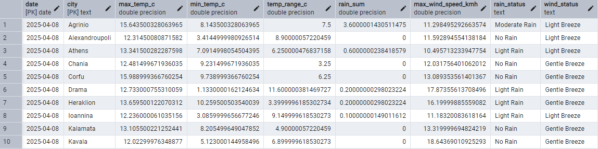
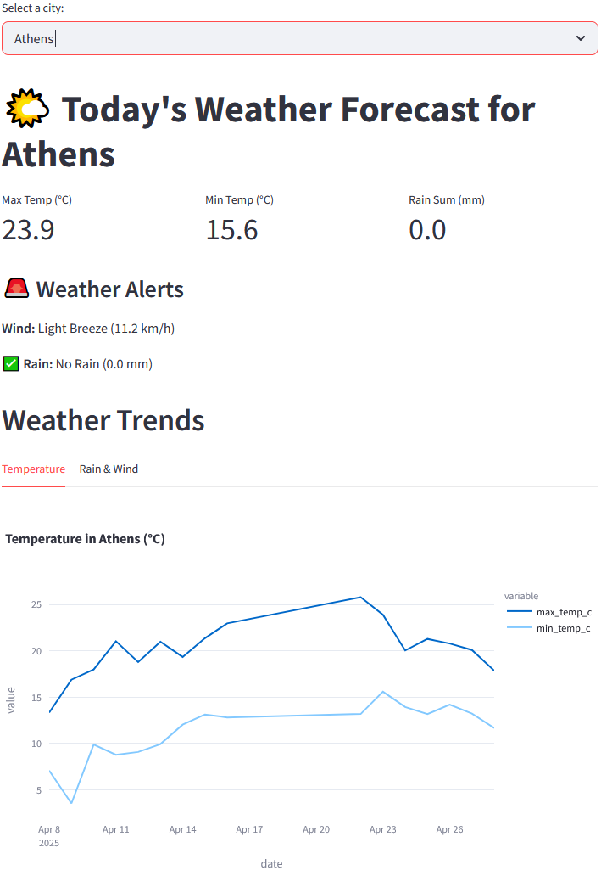
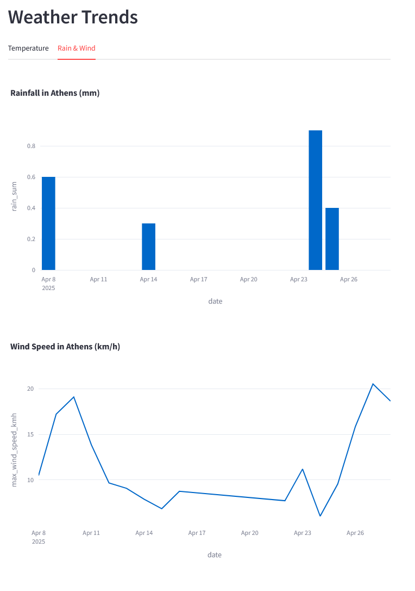

## Weather Data ETL Pipeline + Dashboard

**A data engineering project** that collects, processes and visualizes weather data.
*Built with Python, Streamlit, and PostgreSQL.*

 *(Replace with your deployed link)*  

---

## 📌 Overview
An automated ETL pipeline that collects weather data for cities from [Open-Meteo API](https://open-meteo.com/), cleans & enriches it, and finally stores it in a PostgreSQL database. 

A streamlit dashboard can then be used to display the forecast for the current date, and data trends on the temperature, rainfall and wind speed of a selected city. The total set of cities for which the weather data is going to be fetched is defined in the config.yaml file, but can be configured to be part of a table in the database.

The python script "weather_etl.py" can be scheduled to run daily to get new data but also update the current one to have improved accuracy. 

## 🛠️ Tech Stack
| Component       | Tools Used |
|----------------|------------|
| **Extraction** | `openmeteo-requests`, `retry-requests` |
| **Transformation** | `pandas`, `numpy` |
| **Database**   | PostgreSQL, `SQLAlchemy` |
| **Visualization** | `Streamlit`, `Plotly` |
| **Deployment** | Streamlit Cloud, Docker *(optional)* |

## Database Schema
The pipeline stores the data in a PostgreSQL Database with the following schema: 

CREATE TABLE weather (
   date date NOT NULL,
   city text NOT NULL,
   max_temp_c double precision,
   min_temp_c double precision,
   temp_range_c double precision,
   rain_sum double precision,
   max_wind_speed_kmh double precision,
   rain_status text,
   wind_status text,
   CONSTRAINT weather_pkey PRIMARY KEY (date, city)
)

---

## 🔧 Setup
1. **Clone the repository**:
   git clone https://github.com/KCastas/weather-etl.git
   cd weather-etl
2. **Install dependencies**:
   pip install -r requirements.txt
3. **Configure the .env.example file with database credentials and rename to .env

## Project Structure

weather-etl/
├── src/
│   ├── etl_pipeline.py      # ETL script
│   └── dashboard.py         # Streamlit app
├── imgs/                    # Screenshots for README.md
├── .env                     # PostgreSQL Credentials
├── Requirements.txt         # Dependencies
└── README.md     